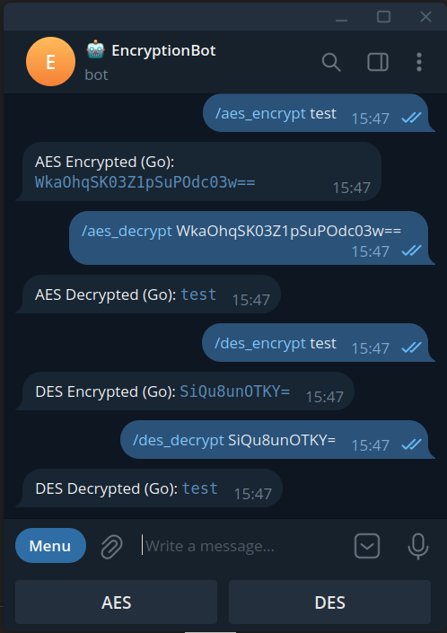
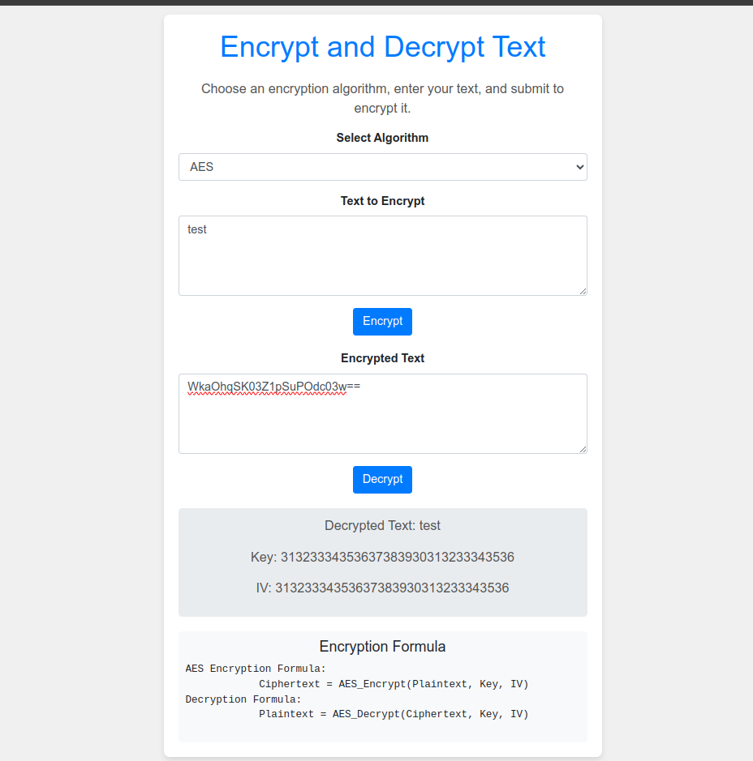

# Encrypt and Decrypt Text

This project is a web application and a Telegram bot that allows users to encrypt and decrypt text using AES (Advanced Encryption Standard) and DES (Data Encryption Standard) algorithms. The backend is built with Golang, and the frontend is developed using HTML and CSS.

## Features

- Encrypt text using AES and DES algorithms.
- Decrypt text using AES and DES algorithms.
- User-friendly web interface and formulas for encryption and decryption.
- Interactive Telegram bot for encryption and decryption.

## Technologies Used

- HTML, CSS, JavaScript
- CryptoJS, Bootstrap
- Go

## Getting Started

### Prerequisites

- Go (https://golang.org/doc/install)
- A web browser

### Installation

1. Clone the repository:
    ```sh
    git clone https://github.com/realtemirov/encryption-bsc.git
    cd encryption-bsc
    ```

2. Set up the Go environment and dependencies:
    ```sh
    go mod init encryption-bsc
    go mod tidy
    ```

## Usage

### Web Interface

1. Open `index.html` in your web browser.

2. Use the form to select an encryption algorithm (AES or DES), enter the text to encrypt, and submit.

3. Copy the encrypted text and paste it into the decryption form to decrypt.

### Go Backend

1. Run the Go program:
    ```sh
    go run main.go
    ```

2. The program will output the encrypted and decrypted text for both AES and DES algorithms.

## Code Explanation

### CryptoJS (JavaScript)

- The key and IV are defined as 16 bytes for AES and 8 bytes for DES.
- PKCS7 padding is used.
- Encryption and decryption are performed in CBC mode.

### Go Implementation

- The `pad` and `unpad` functions handle PKCS7 padding.
- The `encryptAES` and `decryptAES` functions handle AES encryption and decryption.
- The `encryptDES` and `decryptDES` functions handle DES encryption and decryption.
- Base64 encoding is used for ciphertext to ensure compatibility with CryptoJS.

## Bot commands
- `/aes_encrypt <text>`: Encrypts the provided text using AES.
- `/aes_decrypt <encrypted_text>`: Decrypts the provided AES encrypted text.
- `/des_encrypt <text>`: Encrypts the provided text using DES.
- `/des_decrypt <encrypted_text>`: Decrypts the provided DES encrypted text.

## Explanation
- **Padding**: Implements PKCS7 padding to ensure the text fits the block size.
- **Encryption/Decryption Functions**: Implements AES and DES encryption and decryption in CBC mode with PKCS7 padding.
- **Telegram Bot**: Handles commands to encrypt and decrypt text using the provided algorithms. It uses the tgbotapi package to interact with the Telegram Bot API.

With this setup, your Telegram bot `@encryption_robot` should be able to encrypt and decrypt text using AES and DES algorithms.

## Examples





- Bot: [@encryption_robot](https://t.me/encryption_robot)
- Website [here](http://bmi.realtemirov.uz/)

## License

This project is licensed under the MIT License. See the [LICENSE](LICENSE) file for details.